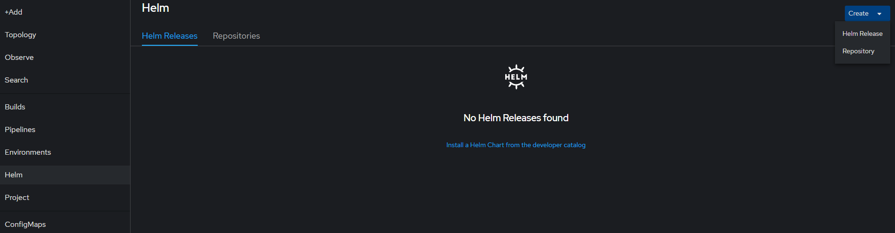
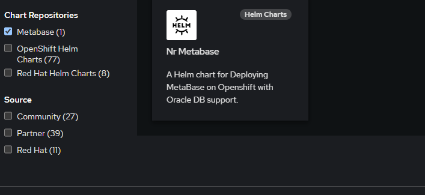

# NR Metabase
A Helm Chart to deploy a Metabase Instance with Encrypted Listener Support to do reporting against Oracle DB.

## How to Deploy to OpenShift using the OpenShift Console.
1. Login to OpenShift GUI.
2. Go to the namespace where you want to deploy this chart.
3. Switch to Developer view.
4. Click on Helm
5. Click on Repository on the right hand side.
6. Give a name, for example: `metabase`
7. Give the URL: `https://bcgov.github.io/nr-metabase/`, click on Create.
8. Go to Helm on the left hand menu again and click on `Install a Helm Chart from the developer catalog`
9. You should see `metabase` in the list, click on it.
10. Click on the Nr Metabase and then install Helm Chart button.
11. Select Chart version, which is same as metabase version, for example: `0.47.1` and click on Install button.
