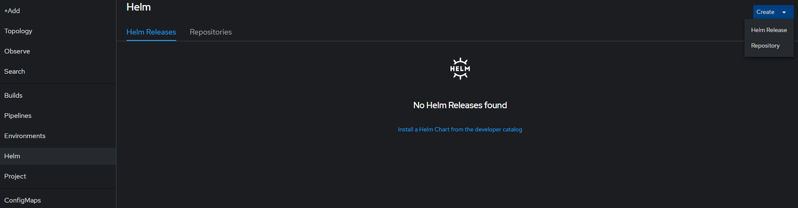
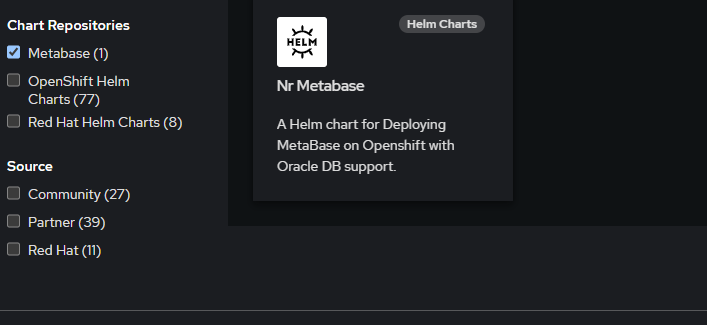

# NR Metabase

A production-ready Helm chart that deploys [Metabase](https://www.metabase.com/) on **OpenShift** with first-class support for reporting against **Oracle** databases over **encrypted (TLS) listeners**.

The chart ships a custom Metabase image bundling the Oracle JDBC driver, auto-provisions a PostgreSQL application database, and wires up scheduled backups, network policies, and TLS routing — so a working analytics instance is one `helm install` away.

---

## Table of Contents

- [Why this chart](#why-this-chart)
- [Architecture](#architecture)
- [Quick start](#quick-start) — deploy from the OpenShift console
- [Configuration reference](#configuration-reference)
- [Connecting to an Oracle database over TLS](#connecting-to-an-oracle-database-over-tls)
- [LDAP / IDIR single sign-on](#ldap--idir-single-sign-on)
- [Operations](#operations) — backups, secrets, health, logging
- [CI/CD & releases](#cicd--releases)
- [Repository layout](#repository-layout)
- [Compliance](#compliance)
- [Maintainers](#maintainers)

---

## Why this chart

The stock Metabase image cannot talk to Oracle, and it certainly cannot talk to an Oracle listener that enforces TLS. This chart solves both problems and packages the surrounding platform concerns:

| Capability | How it's delivered |
|---|---|
| **Oracle connectivity** | Custom image bundles the `ojdbc8-full` driver into Metabase's `/plugins` directory |
| **Encrypted Oracle listeners** | Startup script performs a TLS handshake against each Oracle host, extracts the leaf certificate, and imports it into the JVM truststore before Metabase boots |
| **Application database** | Bundled PostgreSQL sub-chart stores Metabase's own metadata (questions, dashboards, users) |
| **Backups** | Bundled `backup-container` sub-chart with a rolling retention schedule |
| **Secure by default** | Auto-generated DB password, encrypted Metabase secrets, strong password policy, network policies |
| **Zero-downtime ops** | Startup/liveness/readiness probes, edge-terminated TLS route, atomic Helm upgrades |

---

## Architecture

```
                          ┌──────────────────────────────────────────┐
   Browser  ──HTTPS──▶    │  OpenShift Route (edge TLS, HTTP→HTTPS)    │
                          └──────────────────────┬───────────────────┘
                                                 │
                                       ┌─────────▼─────────┐
                                       │  Service (:80→3000)│
                                       └─────────┬─────────┘
                                                 │
                 ┌───────────────────────────────▼────────────────────────────────┐
                 │  Metabase Pod (custom image)                                    │
                 │   • metabase.jar on Temurin 21                                  │
                 │   • ojdbc8-full Oracle driver in /plugins                       │
                 │   • run_app.sh imports Oracle TLS certs → JVM cacerts at start  │
                 │   • log4j2 config mounted from ConfigMap                        │
                 └───────┬─────────────────────────────────────┬───────────────────┘
                         │ app metadata                         │ reporting queries
                         ▼                                      ▼
              ┌────────────────────┐                 ┌──────────────────────────┐
              │ PostgreSQL 15      │                 │ Oracle DB(s) (external)   │
              │ (bundled sub-chart)│                 │ over encrypted listener   │
              └─────────┬──────────┘                 └──────────────────────────┘
                        │ scheduled dumps
                        ▼
              ┌────────────────────┐
              │ backup-container   │
              │ (rolling retention)│
              └────────────────────┘
```

**Component split**

- **`metabase`** — the application itself. Custom image, deployment, service, route, log4j2 ConfigMap.
- **`database`** — PostgreSQL sub-chart holding Metabase's internal state. Backed by a persistent volume.
- **`backup`** — `backup-container` sub-chart that periodically dumps PostgreSQL to a separate backup volume.
- **Cluster glue** — auto-generated `Secret`, two `NetworkPolicy` objects (allow OpenShift ingress + allow same-namespace traffic).

---

## Quick start

Deploy directly from the OpenShift web console — no local tooling required.

1. Log in to the **OpenShift web console** and select the target namespace.
2. Switch to the **Developer** perspective → **Helm**.
3. Open **Repositories** → **Create Helm Repository**.
   
4. Name it `metabase` and set the URL to:
   ```
   https://bcgov.github.io/nr-metabase/
   ```
   Click **Create**.
5. Return to **Helm** → **Install a Helm Chart from the developer catalog**.
6. Select **Nr Metabase** from the catalog.
   
7. Choose the chart version (it tracks the Metabase app version, e.g. `0.48.7`) and click **Install**.

When the pods report **Ready**, browse to the generated route to reach the Metabase setup wizard.

> **Tip — install with the CLI instead**
> ```bash
> helm repo add metabase https://bcgov.github.io/nr-metabase/
> helm repo update
> helm upgrade --install metabase metabase/nr-metabase \
>   --set global.zone=prod \
>   --set global.domain=apps.silver.devops.gov.bc.ca \
>   --wait --atomic
> ```

---

## Configuration reference

All values live in `charts/nr-metabase/values.yaml` and are validated against `values.schema.json`. The most commonly tuned settings:

### Global

| Key | Default | Description |
|---|---|---|
| `global.zone` | `prod` | Deployment zone / instance suffix (`dev`, `test`, `prod`, or a PR number). **Required.** |
| `global.domain` | `apps.silver.devops.gov.bc.ca` | Cluster app domain used to build the route hostname. **Required.** |
| `global.secrets.databaseName` | `metabase` | Name of the Metabase application database. |
| `global.secrets.databaseUser` | `metabase` | Application database user. |
| `global.secrets.databasePassword` | _(auto-generated)_ | Leave unset to auto-generate and persist a random password. |

### Metabase

| Key | Default | Description |
|---|---|---|
| `metabase.enabled` | `true` | Toggle the Metabase component. |
| `metabase.replicaCount` | `1` | Pod replicas (Metabase is not horizontally scalable by default). |
| `metabase.metabaseImage.tag` | `v0.61.1` | Metabase version actually deployed by the pod. |
| `metabase.dbHostPortEnv` | `~` | Comma-separated `host:port` list of Oracle endpoints whose TLS certs are imported at startup. |
| `metabase.service.port` / `targetPort` | `80` / `3000` | Service port mapping. |
| `metabase.resources.requests` | `250m` CPU / `1200Mi` | Resource requests. |
| `metabase.routeOverride` | _(unset)_ | Override the auto-generated route hostname. |

### Database (PostgreSQL)

| Key | Default | Description |
|---|---|---|
| `database.enabled` | `true` | Deploy the bundled PostgreSQL. |
| `database.image.tag` | `15.14` | PostgreSQL image tag. |
| `database.persistence.size` | `740Mi` | PVC size for application metadata. |
| `database.persistence.storageClass` | `netapp-block-standard` | Storage class for the data volume. |

### Backups

| Key | Default | Description |
|---|---|---|
| `backup.enabled` | `true` | Deploy the backup CronJob. |
| `backup.schedule` | `0 0/4 * * *` | Cron schedule (every 4 hours). |
| `backup.strategy` | `rolling` | `rolling` or `daily` retention strategy. |
| `backup.dailyBackups` / `weeklyBackups` / `monthlyBackups` | `7` / `4` / `1` | Rolling retention counts. |
| `backup.persistence.storageClass` | `netapp-file-backup` | Storage class for backup volume. |

---

## Connecting to an Oracle database over TLS

Oracle listeners that enforce encryption present a server certificate during the TNS handshake. Metabase's JVM must trust that certificate or the connection fails. This chart automates trust establishment:

1. Set `metabase.dbHostPortEnv` to the Oracle endpoint(s), e.g.:
   ```yaml
   metabase:
     dbHostPortEnv: "oracle-host.example.gov.bc.ca:1543"
   ```
   Multiple endpoints are comma-separated: `"hostA:1543,hostB:1543"`.
2. At container start, `run_app.sh`:
   - Opens a TLS connection to each `host:port` and extracts the leaf certificate (`openssl s_client`).
   - Converts it PEM → DER and imports it into the JVM truststore (`$JAVA_HOME/lib/security/cacerts`) via `keytool`.
   - Skips and warns on any endpoint that fails the handshake, then continues booting.
3. Add the Oracle data source in the Metabase UI as usual — the JVM now trusts the listener.

> Certificate import happens on **every pod start**, so rotated certificates are picked up automatically on the next restart.

---

## LDAP / IDIR single sign-on

To let users log in with their **IDIR** credentials, follow the LDAP integration guide (IDIR-protected):

➡️ [LDAP Integration on Confluence](https://apps.nrs.gov.bc.ca/int/confluence/display/OPTIMIZE/LDAP+Integration)

Once configured, sign in with the email address associated with your IDIR account.

---

## Operations

### Secrets & encryption
- The application database password is **auto-generated** on first install and persisted in a Kubernetes `Secret` (named `<release>-<zone>`). Re-running `helm upgrade` reuses the existing value via a `lookup`, so the password is stable across upgrades.
- The same value seeds `MB_ENCRYPTION_SECRET_KEY`, encrypting sensitive connection details Metabase stores about your data sources.
- `MB_PASSWORD_COMPLEXITY=strong` enforces strong local Metabase passwords.

### Health & resilience
The deployment defines three probes against `/api/health`:
- **Startup** — up to ~100s grace while Metabase initializes its app DB.
- **Liveness** — restarts the pod if it stops responding.
- **Readiness** — holds traffic until the instance can serve requests.

Upgrades run with `--wait --atomic`, so a failed rollout is automatically rolled back.

### Logging
A mounted log4j2 ConfigMap:
- Suppresses noisy `/api/health` probe lines.
- Redacts `basic-auth` tokens from logs.
- Raises `metabase.sync` / `metabase.driver` to `ERROR` to cut chatter while keeping middleware at `DEBUG`.

### Networking
Two `NetworkPolicy` objects ship with the chart: one permits OpenShift router ingress, the other allows pod-to-pod traffic within the namespace. All other ingress is denied by default.

---

## CI/CD & releases

GitHub Actions automate build, deploy, and release:

| Workflow | Trigger | What it does |
|---|---|---|
| `on-pr-main.yml` | PR opened/updated against `main` | Extracts the Metabase version, builds the image (tagged with the commit SHA and PR number), and deploys an ephemeral instance to OpenShift (`zone` = PR number) for review. |
| `pr-close.yml` | PR closed | Tears down the PR's ephemeral resources. |
| `merge-main.yml` | Push to `main` | Re-tags the reviewed image, packages the Helm chart (version derived from the Metabase version), and publishes it to the `gh-pages` Helm repository via chart-releaser. |
| `dependabot-auto-merge.yml` | Dependabot PRs | Auto-merges passing dependency bumps. |

Dependency hygiene is handled by both **Renovate** (`renovate.json`) and **Dependabot** (`.github/dependabot.yml`).

The published Helm repository is served at **https://bcgov.github.io/nr-metabase/**.

---

## Repository layout

```
nr-metabase/
├── charts/nr-metabase/          # The Helm chart
│   ├── Chart.yaml               # Chart + app version, sub-chart dependencies
│   ├── values.yaml              # Default configuration
│   ├── values.schema.json       # JSON schema validating values.yaml
│   └── templates/
│       ├── _helpers.tpl         # Name/label template helpers
│       ├── secret.yaml          # Auto-generated DB credentials
│       ├── knp.yaml             # Network policies
│       └── metabase/            # Deployment, Service, Route, log4j2 ConfigMap
├── metabase/                    # Custom image build context
│   ├── Dockerfile               # Temurin 21 + Oracle driver + metabase.jar
│   ├── run_app.sh               # TLS cert import + tuned JVM launch
│   └── ojdbc8-full/             # Bundled Oracle JDBC driver
├── .github/workflows/           # CI/CD pipelines
├── COMPLIANCE.yaml              # PIA / STRA tracking
└── README.md
```

### How the image is built
The `metabase/Dockerfile` starts from `eclipse-temurin:21-jammy`, copies the Oracle driver into `/plugins`, downloads the pinned `metabase.jar` at build time (version passed via the `METABASE_VERSION` build arg), and sets `run_app.sh` as the entrypoint. The container runs as non-root (UID 185). `run_app.sh` imports any configured Oracle TLS certificates, then launches the JVM with GC and heap flags tuned for a memory-constrained pod.


Licensed under the terms in [`LICENSE`](./LICENSE).
