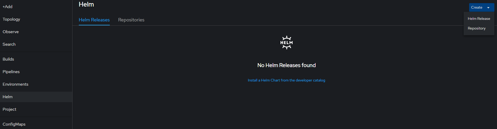
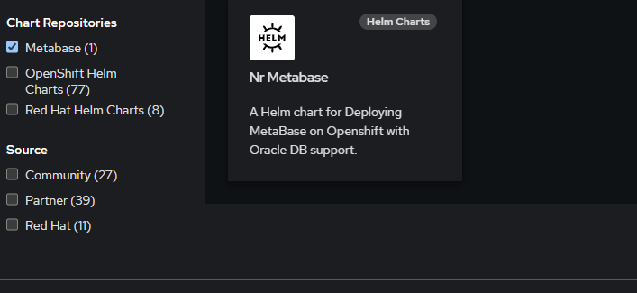

# NR Metabase

A production-ready Helm chart that deploys [Metabase](https://www.metabase.com/) on **OpenShift** with first-class support for reporting against **Oracle** databases over **encrypted (TLS) listeners**.

The chart ships a custom Metabase image bundling the Oracle JDBC driver, auto-provisions a PostgreSQL application database, and wires up scheduled backups, network policies, and TLS routing — so a working analytics instance is one `helm install` away.

---

## Quick Navigation

- [Why this chart](#why-this-chart)
- [Architecture](#architecture)
- [Quick start](#quick-start)
- [Configuration reference](#configuration-reference)
- [Connecting to an Oracle database over TLS](#connecting-to-an-oracle-database-over-tls)
- [LDAP / IDIR single sign-on](#ldap--idir-single-sign-on)
- [Operations](#operations)
- [CI/CD & releases](#cicd--releases)
- [Repository layout](#repository-layout)
- [FAQ](#faq)

---

## Why this chart

The stock Metabase image cannot talk to Oracle, and it certainly cannot talk to an Oracle listener that enforces TLS. This chart solves both problems and packages the surrounding platform concerns:

| Capability | How it's delivered |
|---|---|
| **Oracle connectivity** | Custom image bundles the `ojdbc8-full` driver into Metabase's `/plugins` directory |
| **Encrypted Oracle listeners** | Startup script performs a TLS handshake against each Oracle host, extracts the leaf certificate, and imports it into the JVM truststore before Metabase boots |
| **Application database** | Bundled PostgreSQL sub-chart stores Metabase's own metadata (questions, dashboards, users) |
| **Backups** | Bundled `backup-container` sub-chart with a rolling retention schedule |
| **Secure by default** | Auto-generated DB password, encrypted Metabase secrets, strong password policy, network policies |
| **Operational safety** | Startup/liveness/readiness probes, edge-terminated TLS route, atomic Helm upgrades that auto-rollback on failure ([FAQ](#faq): upgrades restart the pod, so expect a short gap) |

---

## Architecture

```
                          ┌──────────────────────────────────────────────┐
   Browser  ──HTTPS──▶    │  OpenShift Route (edge TLS, HTTP→HTTPS)    │
                          └──────────────────────┬──────────────────────┘
                                                 │
                                       ┌─────────────┬──────────┐
                                       │  Service (:80→3000)   │
                                       └─────────────┬──────────┘
                                                 │
                 ┌─────────────────────────────────────────────────────────┐
                 │  Metabase Pod (custom image)                            │
                 │   • metabase.jar (vx.x.x) on Temurin 25                │
                 │   • ojdbc8-full Oracle driver in /plugins               │
                 │   • run_app.sh imports Oracle TLS certs → JVM cacerts   │
                 │   • log4j2 config mounted from ConfigMap                │
                 └────────────────┬──────────────────────────┬─────────────┘
                         │ app metadata                    │ reporting queries
                         ▼                                 ▼
              ┌──────────────────────┐         ┌──────────────────────────┐
              │ PostgreSQL 15.14     │         │ Oracle DB(s) (external)  │
              │ (bundled sub-chart)  │         │ over encrypted listener  │
              └──────────┬───────────┘         └──────────────────────────┘
                         │ scheduled dumps
                         ▼
              ┌──────────────────────┐
              │ backup-container     │
              │ (rolling retention)  │
              └──────────────────────┘
```

**Component breakdown:**

- **`metabase`** — Application container with custom image, deployment, service, route, and log4j2 ConfigMap
- **`database`** — PostgreSQL 15 sub-chart holding Metabase's internal state with persistent volume
- **`backup`** — `backup-container` sub-chart for periodic PostgreSQL backups
- **Cluster integration** — Auto-generated Secret, NetworkPolicy objects (OpenShift ingress + same-namespace traffic)

---

## Quick start

Deploy directly from the OpenShift web console — no local tooling required.

### Via OpenShift Console

1. Log in to the **OpenShift web console** and select the target namespace.
2. Switch to the **Developer** perspective → **Helm**.
3. Open **Repositories** → **Create Helm Repository**.
   
4. Name it `metabase` and set the URL to:
   ```
   https://bcgov.github.io/nr-metabase/
   ```
   Click **Create**.
5. Return to **Helm** → **Install a Helm Chart from the developer catalog**.
6. Select **Nr Metabase** from the catalog.
   
7. Configure required settings (`global.zone`, `global.domain`) and click **Install**.

When the pods report **Ready**, browse to the generated route to reach the Metabase setup wizard.

### Via CLI

```bash
helm repo add metabase https://bcgov.github.io/nr-metabase/
helm repo update
helm upgrade --install metabase metabase/nr-metabase \
  --set global.zone=prod \
  --set global.domain=apps.silver.devops.gov.bc.ca \
  --wait --atomic
```

---

## Configuration reference

All values live in `charts/nr-metabase/values.yaml` and are validated against `values.schema.json`. The most commonly tuned settings:

### Global

| Key | Default | Description |
|---|---|---|
| `global.zone` | `prod` | Deployment zone / instance suffix (`dev`, `test`, `prod`, or a PR number). **Required.** |
| `global.domain` | `apps.silver.devops.gov.bc.ca` | Cluster app domain used to build the route hostname. **Required.** |
| `global.secrets.databaseName` | `metabase` | Name of the Metabase application database. |
| `global.secrets.databaseUser` | `metabase` | Application database user. |
| `global.secrets.databasePassword` | _(auto-generated)_ | Leave unset to auto-generate and persist a random password. |

### Metabase

| Key | Default | Description |
|---|---|---|
| `metabase.enabled` | `true` | Toggle the Metabase component. |
| `metabase.replicaCount` | `1` | Pod replicas (Metabase is not horizontally scalable by default). |
| `metabase.metabaseImage.tag` | `vx.x.x` | Metabase version deployed by the pod. |
| `metabase.dbHostPortEnv` | `~` | Comma-separated `host:port` list of Oracle endpoints whose TLS certs are imported at startup. |
| `metabase.service.port` / `targetPort` | `80` / `3000` | Service port mapping. |
| `metabase.resources.requests` | `250m` CPU / `1200Mi` | Resource requests. |
| `metabase.resources.limits.memory` | _(see values.yaml)_ | Memory ceiling for the pod. Controls the JVM heap size — see [FAQ](#faq). |
| `metabase.routeOverride` | _(unset)_ | Override the auto-generated route hostname. |

### Database (PostgreSQL)

| Key | Default | Description |
|---|---|---|
| `database.enabled` | `true` | Deploy the bundled PostgreSQL. |
| `database.image.tag` | `15.14` | PostgreSQL version. |
| `database.persistence.size` | `740Mi` | PVC size for application metadata. |
| `database.persistence.storageClass` | `netapp-block-standard` | Storage class for the data volume. |

### Backups

| Key | Default | Description |
|---|---|---|
| `backup.enabled` | `true` | Deploy the backup CronJob. |
| `backup.schedule` | `0 0/4 * * *` | Cron schedule (every 4 hours). |
| `backup.strategy` | `rolling` | `rolling` or `daily` retention strategy. |
| `backup.dailyBackups` / `weeklyBackups` / `monthlyBackups` | `7` / `4` / `1` | Rolling retention counts. |
| `backup.persistence.storageClass` | `netapp-file-backup` | Storage class for backup volume. |

---

## Connecting to an Oracle database over TLS

Oracle listeners that enforce encryption present a server certificate during the TNS handshake. Metabase's JVM must trust that certificate or the connection fails. This chart automates trust establishment:

1. Set `metabase.dbHostPortEnv` to the Oracle endpoint(s), e.g.:
   ```yaml
   metabase:
     dbHostPortEnv: "oracle-host.example.gov.bc.ca:1543"
   ```
   Multiple endpoints are comma-separated: `"hostA:1543,hostB:1543"`.

2. At container start, `run_app.sh`:
   - Opens a TLS connection to each `host:port` and extracts the leaf certificate (`openssl s_client`).
   - Converts it PEM → DER and imports it into the JVM truststore (`$JAVA_HOME/lib/security/cacerts`) via `keytool`.
   - Skips and warns on any endpoint that fails the handshake, then continues booting.

3. Add the Oracle data source in the Metabase UI as usual — the JVM now trusts the listener.

> **Certificate rotation:** Import happens on **every pod start**, so rotated certificates are picked up automatically on the next restart.

---

## LDAP / IDIR single sign-on

To let users log in with their **IDIR** credentials, follow the LDAP integration guide (IDIR-protected):

➡️ [LDAP Integration on Confluence](https://apps.nrs.gov.bc.ca/int/confluence/display/OPTIMIZE/LDAP+Integration)

Once configured, sign in with the email address associated with your IDIR account.

---

## Operations

### Secrets & encryption

- The application database password is **auto-generated** on first install and persisted in a Kubernetes `Secret` (named `<release>-<zone>`). Re-running `helm upgrade` reuses the existing value via a `lookup`, so the password is stable across upgrades.
- The same value seeds `MB_ENCRYPTION_SECRET_KEY`, encrypting sensitive connection details Metabase stores about your data sources.
- `MB_PASSWORD_COMPLEXITY=strong` enforces strong local Metabase passwords.

### Health & resilience

The deployment defines three probes against `/api/health`:
- **Startup** — up to ~100s grace while Metabase initializes its app DB.
- **Liveness** — restarts the pod if it stops responding.
- **Readiness** — holds traffic until the instance can serve requests.

Upgrades run with `--wait --atomic`, so a failed rollout is automatically rolled back.

### Logging

A mounted log4j2 ConfigMap:
- Suppresses noisy `/api/health` probe lines.
- Redacts `basic-auth` tokens from logs.
- Raises `metabase.sync` / `metabase.driver` to `ERROR` to cut chatter while keeping middleware at `DEBUG`.

### Networking

Two `NetworkPolicy` objects ship with the chart: one permits OpenShift router ingress, the other allows pod-to-pod traffic within the namespace. All other ingress is denied by default.

---

## CI/CD & releases

GitHub Actions automate build, deploy, and release:

| Workflow | Trigger | What it does |
|---|---|---|
| `on-pr-main.yml` | PR opened/updated against `main` | Extracts the Metabase version, builds the image (tagged with the commit SHA and PR number), and deploys an ephemeral instance to OpenShift (`zone` = PR number) for review. |
| `pr-close.yml` | PR closed | Tears down the PR's ephemeral resources. |
| `merge-main.yml` | Push to `main` | Re-tags the reviewed image, packages the Helm chart (version derived from the Metabase version), and publishes it to the `gh-pages` Helm repository via chart-releaser. |
| `dependabot-auto-merge.yml` | Dependabot PRs | Auto-merges passing dependency bumps. |

Dependency hygiene is handled by both **Renovate** (`renovate.json`) and **Dependabot** (`.github/dependabot.yml`).

The published Helm repository is served at **https://bcgov.github.io/nr-metabase/**.

---

## Repository layout

```
nr-metabase/
├── charts/nr-metabase/          # The Helm chart
│   ├── Chart.yaml               # Chart + app version, sub-chart dependencies
│   ├── values.yaml              # Default configuration
│   ├── values.schema.json       # JSON schema validating values.yaml
│   └── templates/
│       ├── _helpers.tpl         # Name/label template helpers
│       ├── secret.yaml          # Auto-generated DB credentials
│       ├── knp.yaml             # Network policies
│       └── metabase/            # Deployment, Service, Route, log4j2 ConfigMap
├── metabase/                    # Custom image build context
│   ├── Dockerfile               # Temurin 25 + Oracle driver + metabase.jar
│   ├── run_app.sh               # TLS cert import + tuned JVM launch
│   └── ojdbc8-full/             # Bundled Oracle JDBC driver
├── .github/workflows/           # CI/CD pipelines
├── COMPLIANCE.yaml              # PIA / STRA tracking
└── README.md
```

### How the image is built

The `metabase/Dockerfile` starts from `eclipse-temurin:25-jammy`, relaxes `jdk.tls.disabledAlgorithms` so the JVM can complete a TLS handshake with the Oracle DB's legacy cert, copies the Oracle driver into `/plugins`, downloads the pinned `metabase.jar` at build time (version passed via the `METABASE_VERSION` build arg), and sets `run_app.sh` as the entrypoint. The container runs as non-root (UID 185). `run_app.sh` imports any configured Oracle TLS certificates, then launches the JVM with GC and heap flags tuned for a memory-constrained pod.

---

## FAQ

### Why does the pod stop with the reason OOMKilled?

OOMKilled is a Kubernetes status. It shows that the pod tried to use more memory than its memory limit allows. The node stops the pod at once. This action protects other pods on the same node.

Use this command to check the event:

```bash
oc describe pod <pod-name> -n <namespace>
```

Look for these two items in the output:
- The reason: `OOMKilled`
- The exit code: `137`

### Why does this happen to the Metabase pod?

The JVM heap is not a fixed size. It is a percentage of the memory limit for the pod (`metabase.resources.limits.memory` in `values.yaml`). The JVM also uses memory outside the heap:

- Metaspace
- Thread stacks
- Buffers for the Oracle and PostgreSQL drivers

If the memory limit is too low for these two parts, the pod reaches the memory limit. OpenShift then kills the pod, even when the heap itself is not full.

These three settings control the split. Check `values.yaml` and `run_app.sh` for their current values. These values change over time.

| Setting | Where it lives | Role |
|---|---|---|
| `metabase.resources.limits.memory` | `values.yaml` | Total memory the pod can use |
| `MAX_HEAP_PERCENT` | Environment variable in `run_app.sh` | Percent of the limit used for the JVM heap |
| `-XX:MaxMetaspaceSize` | `run_app.sh` | Metaspace ceiling |

### How do I fix an OOMKilled pod?

Two settings control this. Change one setting, or both settings, together:

1. **Raise the memory limit.** Change `metabase.resources.limits.memory` in `values.yaml`. Run `helm upgrade` next. This gives the pod more total memory. The same heap percentage then leaves more room for other memory types.
2. **Lower the heap percentage.** Set the `MAX_HEAP_PERCENT` and `MIN_HEAP_PERCENT` environment variables to a lower number. For example, use `50`. This makes the heap smaller. It leaves more room for metaspace and other native memory. The memory limit stays the same.

Do not raise `MAX_HEAP_PERCENT` by itself. Raise the memory limit at the same time. A higher percentage alone leaves less room for other memory. It can make a new OOMKilled event more likely.

### What is a safe starting point for the memory limit and heap percentage?

Start with more room, not less. Use this formula for any memory limit:

```
heap size = memory limit x (MAX_HEAP_PERCENT / 100)
room for other memory = memory limit - heap size - metaspace ceiling
```

Find the current memory limit in `values.yaml`, under `metabase.resources.limits.memory`. Find the current percentage and metaspace ceiling in `run_app.sh`.

A lower percentage gives more room for other memory. It also gives Metabase a smaller heap for queries and dashboards.

Check the memory use of the pod after each change:

```bash
oc adm top pod <pod-name> -n <namespace>
```

If OOMKilled events continue after a lower percentage, raise the memory limit next. Check the resource quota for your namespace first. A cluster administrator can set a lower maximum for this value.

### Why did the database password stay the same, or why did the upgrade fail with a Secret error?

The chart does not create a new password on every upgrade. `helm upgrade` reads the existing `Secret` and reuses its values. It ignores `global.secrets.databasePassword` in `values.yaml` when the `Secret` already exists.

This is deliberate. The password also protects `MB_ENCRYPTION_SECRET_KEY`. A new password would lock Metabase out of data it already encrypted.

If the `Secret` is missing on an upgrade, the chart stops with this error:

```
Refusing to upgrade: Secret "..." was not found in namespace "..."
```

This error is a safety check. It stops the chart from creating new credentials for a database that already has data. To fix this:

- Restore the missing `Secret`, if you deleted it by accident.
- Set `global.secrets.allowMissingOnUpgrade` to `true`, only if you know the release has no existing data to protect.

### Why can't Metabase reach my Oracle database over TLS?

Check the pod logs first:

```bash
oc logs <pod-name> -n <namespace>
```

Look for these lines:
- `WARN: TLS handshake or cert extraction failed for <host>:<port>` — the pod did not reach the Oracle host and port. A network rule or firewall can block the connection.
- `WARN: keytool import failed for <host>` — the certificate download worked. The JVM did not trust the certificate.

The chart imports Oracle certificates only once, at pod start. A fix to the network or the Oracle listener has no effect until the pod restarts.

This chart does not store your Oracle database username or password. It only builds trust for the TLS connection. Add the Oracle data source in the Metabase UI, as usual.

### Why is there a short outage during every helm upgrade?

Both the Metabase and the database Deployments use the `Recreate` strategy. This strategy stops the running pod first. It then starts the new pod. There is a short gap where no pod answers requests.

`Recreate` is deliberate here, not a mistake. `replicaCount` is `1` for both components. A rolling update runs two versions at the same time. This creates a risk to shared data.

If your team needs shorter upgrade windows, schedule upgrades outside busy hours. This chart does not currently support a way to remove this gap.

### Why did my merged PR not create a new chart release?

The chart version is not a value you set directly. `merge-main.yml` builds it from two files:
- `metabase.metabaseImage.tag`, in `values.yaml`
- `appVersion`, in `Chart.yaml`

These two values must match. The workflow uses this matched value as the release version.

If a release with that version number already exists, the workflow skips the release step. It does not publish a new chart. This happens even when your merged PR changed chart templates, `values.yaml`, or other files.

To publish a chart-only change, bump the Metabase version in both files. You can also ask a maintainer about a different release process for chart-only fixes.

### Why does my PR review environment disappear after I close the PR?

The `pr-close.yml` workflow removes the review environment when a PR closes. It runs `helm uninstall` for the PR release. This action deletes:

- The Metabase pod
- The database
- All data in the database

Save any data you need before the PR closes.

### Can I restore the database from a backup?

This chart creates backups. It does not run an automated restore step.

The backup CronJob does three things, in order:
- Starts a pod
- Runs one backup
- Stops the pod

There is no standing pod to open a shell into for a restore.

To restore data:
1. Start a temporary pod from the same `bcgovimages/backup-container` image.
2. Attach the backup PVC to this pod.
3. Open a shell into the pod.
4. Run `./backup.sh -r` with the correct database options.

See the [backup-container project](https://github.com/bcgov/backup-container) for exact restore options and flags.

### Can I grow storage after install?

You can raise `database.persistence.size` or `backup.persistence.size` in `values.yaml`. Run `helm upgrade` next. Kubernetes cannot shrink a PVC. Always set a size equal to or larger than the current size.

A storage class must allow volume growth for this change to work. Check this with your cluster administrator before you rely on it.

---

Licensed under the terms in [`LICENSE`](./LICENSE).
